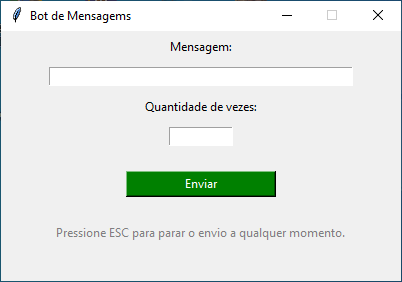

# 📨 Bot de Spammar Mensagens - Python

Um pequeno bot criado em Python com interface gráfica (Tkinter) para enviar mensagens automaticamente em aplicativos como o Discord. O envio pode ser interrompido a qualquer momento com a tecla `ESC`.

---



## 🚀 Funcionalidades

- Interface gráfica simples com Tkinter.
- Envio automatizado de mensagens com `pyautogui`.
- Controle da quantidade de envios.
- Pode ser interrompido a qualquer momento com a tecla `ESC`.
- Build em `.exe` disponível via PyInstaller.

---

## 📦 Tecnologias Utilizadas

- Python 3.x
- Tkinter
- PyAutoGUI
- Threading
- Keyboard
- PyInstaller (para gerar `.exe`)

---

## ⚙️ Como Usar

1. Clone o repositório:
   ```
   git clone https://github.com/seu-usuario/bot-discord-spam.git
   cd bot-discord-spam
````

2. Instale as dependências:

   ```
   pip install pyautogui keyboard
   ```

3. Execute o script:

   ```
   python Chat.py
   ```

4. Ou use o executável:
   Vá até a pasta `dist` e execute `Chat.exe`.

---

## ❗ Aviso Legal

> Este projeto é apenas para fins educacionais. O uso de spam automatizado pode violar os termos de uso de plataformas como Discord, WhatsApp, entre outros. Use com responsabilidade e apenas em ambientes controlados ou com permissão explícita.

---

## 📸 Screenshot

Abaixo está uma imagem da interface do programa em execução:


---

## 🧾 Licença

Este projeto está licenciado sob a licença MIT.

````
